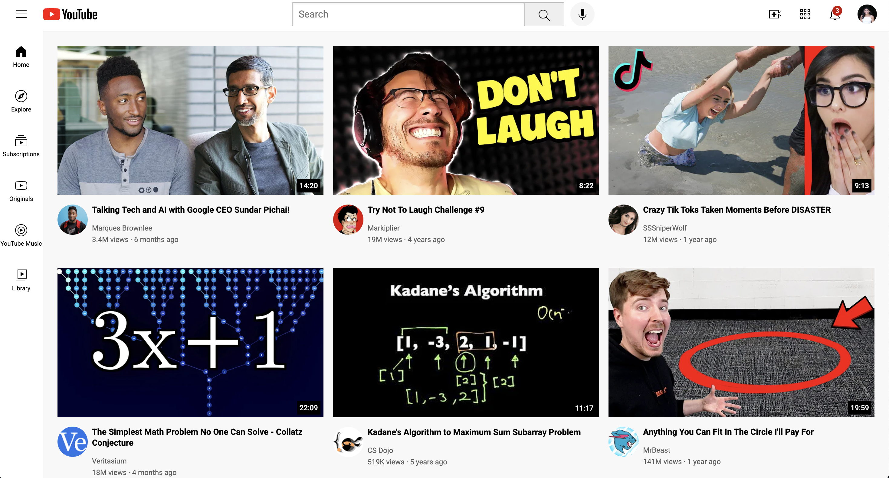

# YouTube UI Clone 🎬

Saloni Agshiker | December 2024

***

## 🎯 Overview

Over winter break, I set out to learn the fundamentals of web development, focusing on front-end technologies like HTML and CSS. I followed this crash course:
- https://www.youtube.com/watch?v=G3e-cpL7ofc

***

## 📚 Key Concepts Learned
- Core HTML elements & semantic structure
- Proper HTML document organization
- Document Object Model (DOM)
- Use of div elements for layout & grouping
- Flexbox for responsive & flexible layouts
- Principles of responsive web design
- CSS properties and CSS Box Model

***

## 📸 Screenshot

